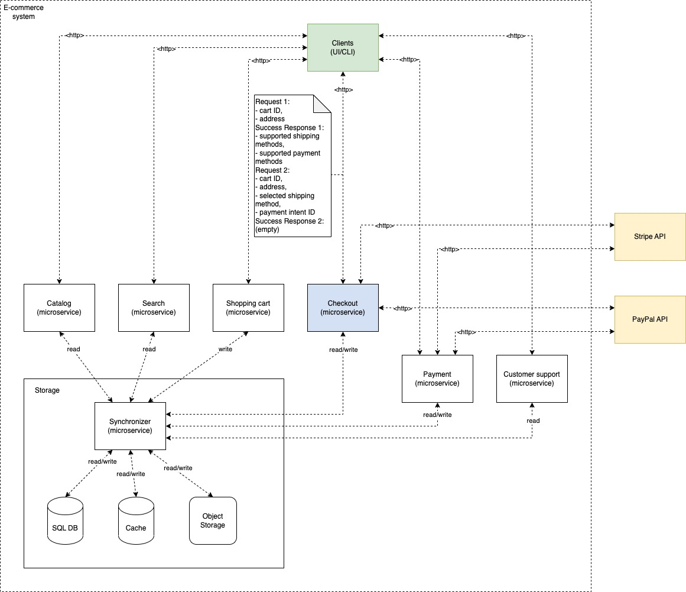

# Checkout Service

The exact description of the task is provided in https://github.com/mgasparic/checkout-service/blob/main/docs/task.pdf.

## System

The entire e-commerce sample system is composed of multiple services. The checkout service is one of them, and it is the
sole focus of this task. The checkout service communicates with the storage synchronizer and with payment systems. It is
expected to receive http requests directly from clients. The components diagram is provided below, for easier
understanding.



## Endpoints

| Path      | Method | Data                                                                                                                                                                                                                                                                    | Success Response                                  | Possible Error Codes                                                                                                        |
|:----------|:-------|:------------------------------------------------------------------------------------------------------------------------------------------------------------------------------------------------------------------------------------------------------------------------|:--------------------------------------------------|:----------------------------------------------------------------------------------------------------------------------------|
| /checkout | POST   | {<br>cartId: string<br>address: {<br>firstName: string<br>lastName: string<br>street: string<br>houseNr: string<br>city: string<br>state: string<br>country: string<br>zip: string}<br>}                                                                                | {<br>shipping: []string<br>payment: []string<br>} | 204 - No Content<br>400 - Bad Request<br>500 - Internal Server Error<br>503 - Service Unavailable                           |
| /payment  | POST   | {<br>cartId: string<br>address: {<br>firstName: string<br>lastName: string<br>street: string<br>houseNr: string<br>city: string<br>state: string<br>country: string<br>zip: string}<br>shippingMethod: string<br>paymentIntent: {<br>id: string<br>method: string}<br>} | NA                                                | 204 - No Content<br>400 - Bad Request<br>402 - Payment Required<br>500 - Internal Server Error<br>503 - Service Unavailable |

## Description of the Solution

Implemented Checkout microservice is a REST API that provides two endpoints. It is stateless, and it is horizontally
scalable, without restrictions. In the real-world scenario, it would be deployed in a Kubernetes cluster, and it would
be exposed to the outside world, either directly or behind a reverse-proxy. It would be important to provide a Storage
Synchronizer microservice that can handle concurrent requests in a safe manner; in particular, it should make sure that
inventory and order management are consistent with the required business logic. In this task, I just assumed that
Storage works as expected, and I created a mock server that is implemented
in https://github.com/mgasparic/checkout-service/tree/main/test/storage_mock.

This microservice can be extended with a more sophisticated business logic and additional payment systems. I added
comments in the code with some ideas. However, for the prototype version, Stripe payments and simple business logic are
sufficient.

## Interaction Example

1. Client sends a request to the checkout service to get the available shipping and payment methods, after it obtained
   address information:

```
# request
curl -X POST localhost:8080/checkout \
-H "Content-Type: application/json" \
-d '{"cart_id": "uuid_existing", "address": {"first_name": "John", "last_name": "Doe", "street": "Main Street",
 "house_nr": "1", "city": "New York", "state": "NY", "country": "USA", "zip": "10001"}}'
# response
{"shipping":["DHL"],"payment":["Stripe"]}
```

2. Client handles payment and obtains desired shipping method (do not forget to replace `[ID]` with the one returned by
   Stripe):

```
# simulation of payment, using Stripe sandbox account
curl https://api.stripe.com/v1/payment_intents \
-u sk_test_51H59owJmQoVhz82aOUNOuCVbK0u1zjyRFKkFp9EfrqzWaUWqQni3oSxljsdTIu2YZ9XvlbeGjZRU7B7ye2EjJQE000Dm2DtMWD: \
-d amount=1099 \
-d currency=usd \
-d "payment_method_types[]"=card \
-d "capture_method"="manual"
# second step
curl https://api.stripe.com/v1/payment_intents/[ID]/confirm \
-u sk_test_51H59owJmQoVhz82aOUNOuCVbK0u1zjyRFKkFp9EfrqzWaUWqQni3oSxljsdTIu2YZ9XvlbeGjZRU7B7ye2EjJQE000Dm2DtMWD: \
-d payment_method=pm_card_visa
```

3. Client sends a request to the checkout service to confirm the payment (do not forget to replace `[ID]` with the one
   returned by Stripe):

```
curl -X POST localhost:8080/payment \
-H "Content-Type: application/json" \
-d '{"cart_id": "uuid_existing", "address": {"first_name": "John", "last_name": "Doe", "street": "Main Street",
 "house_nr": "1", "city": "New York", "state": "NY", "country": "USA", "zip": "10001"}, "shipping_method": "DHL",
 "payment_intent": {"id": "[ID]", "method": "Stripe"}}'
```

4. The payment is collected when the order is shipped.
